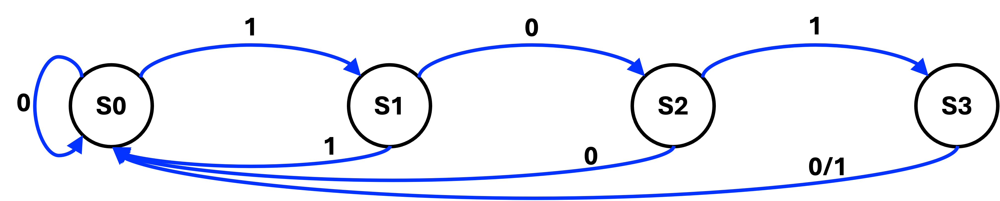
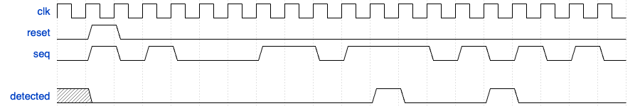

### Prior knowledge

### Finate State Machine

A finite state machine (FSM) is a type of circuit that transitions between a limited number of states based on its current state and input signals. It's a fundamental building block in digital design, used to model and implement sequential logic. An example of the state transition diagram is shown below:



Here's a breakdown of the key concepts:

- States:  Represent the different conditions or modes of operation the FSM can be in. For example, in the above FSM, there are four states: `S0`, `S1`, `S2`, and `S3`.

- Transitions: Define how the FSM moves from one state to another. These transitions are triggered by specific input conditions. In the example above, the transitions are triggered by the a single-bit input, which can be either 0 or 1.
  - For state `S0`, if the input is 0, the FSM will stay in state `S0`. If the input is 1, the FSM will transition to state `S1`.
  - For state `S1`, if the input is 0, the FSM will transition to state `S2`. If the input is 1, the FSM will transition to state `S0`.
  - For state `S2`, if the input is 1, the FSM will transition to state `S3`. If the input is 0, the FSM will transition to state `S0`.
  - For state `S3`, for both input 0 and 1, the FSM will transition to state `S0`.

- Outputs: Actions or signals generated by the FSM based on its current state. For example, we can define a variable that indicates whether the FSM is in the state `S0`.

### Verilog Implementation

Since there are three parts in the FSM, we can implement the FSM by using three parts of code blocks.

- **State Register**: This block is used to store the current state of the FSM and update the state based on the clock signal.
```verilog
reg [1:0] state;
always @(posedge clk) begin
    if (reset) begin
        state <= S0;
    end else begin
        state <= next_state;
    end
end
```
- **Next State Logic**: This block is used to determine the next state of the FSM based on the current state and input.
```verilog
always @(*) begin
    case (state)
        S0: next_state = input ? S1 : S0;
        S1: next_state = input ? S0 : S2;
        S2: next_state = input ? S3 : S0;
        S3: next_state = S0;
    endcase
end
```
- **Output Logic**: This block is used to generate the output of the FSM based on the current state.
```verilog
assign output = (state == S0);
```

### Practice:

Implement a FSM-based sequence detector that detects the sequence '1101' within an input stream. When the sequence is detected, the output (port name: detected) should be 1; otherwise, it should be 0. The detector must be able to detect consecutive sequences. An example of the input and output is shown below.


